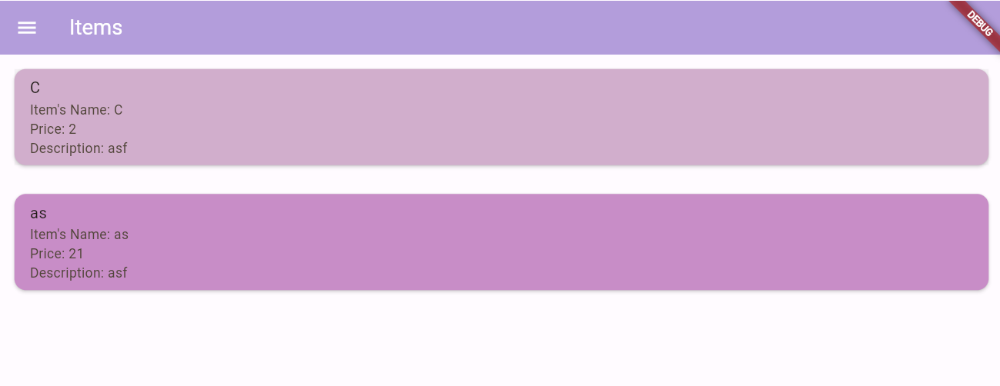

# CodaShop : Everything you need.

# Assignment 9

# Apakah bisa kita melakukan pengambilan data JSON tanpa membuat model terlebih dahulu? Jika iya, apakah hal tersebut lebih baik daripada membuat model sebelum melakukan pengambilan data JSON?

Jawabannya, `iya bisa saja` dengan methode parsing. Akan tetapi, jika data json yang kita buat cukup kompleks, maka pembuatan model diperlukan agar lebih mudah.

#  Jelaskan fungsi dari CookieRequest dan jelaskan mengapa instance CookieRequest perlu untuk dibagikan ke semua komponen di aplikasi Flutter.
Fungsi utama `CookieRequest` :

1. Penanganan Cookies

2. Safety and operating cookies

3. User session (logout dan login)

4. Request HTTP (POST,GET,POSTJSON)

Mengapa instance CookieRequest perlu untuk dibagikan ke semua komponen di aplikasi flutter?

1. Pengelolaan Otentikasi: Memungkinkannya komunikasi yang efektif pada server dikarenakan CookieRequest menyimpan informasi dari cookies.

2. Pemrosesan HTTP : Tidak perlu terus menerus dilakukan autentifikasi dikarenakan cookies tersimpan.

3. Cookies management : Dapat menghandle and manipulasi cookies secara konsisten.

# Jelaskan mekanisme pengambilan data dari JSON hingga dapat ditampilkan pada Flutter.

Melalui url dari django, data akan dikonversi menjadi data json. Setelah itu, dibuat list item hasil dari konversi data json tersebut. Dengan adanya `FlutterBuilder`, memungkinkannya data item dapat diambil. Lalu, penggunaan ListViewbuilder memungkinkan kita untuk melihat hasil dari konversi data item tersebut.

# Jelaskan mekanisme autentikasi dari input data akun pada Flutter ke Django hingga selesainya proses autentikasi oleh Django dan tampilnya menu pada Flutter.

Kita dapat menggunakan `TextField` untuk input username serta passowrd yang akan diinput pengguna pada flutter. Lalu, data yang sudah diinput tersebut akan dikonversi menjadi variabel username dan juga password. Setelah itu, aplikasi akan mengirimkan request HTTP melalui server django (/auth/login).

# Sebutkan seluruh widget yang kamu pakai pada tugas ini dan jelaskan fungsinya masing-masing.

1. `Navigator` : Mengatur Stack

2. `ListView.builder` : Melihat/menampilkan konversi data json untuk item

3. `SnackBar` : Popup

4. `Scaffold` : Kerangka/struktur dasar

5. `Text field` : Sebagai input

6. `Container` : Memposisikan(styling) widget

7. `Appbar` : Menampilkan bar navigasi

8. `Column` : Membuat tampilan vertikal

# Jelaskan Step-Step nya !

# Deployment
Sampai saat ini, deployment saya masih terasa cukup sulit dan 'rusak' sehingga saya masih attach menggunakan lokal

# Membuat halaman login pada proyek tugas Flutter.

Kita coba integrasikan autentifikasi django flutter dengan cara : 

- membuat django app autentication dan masukan pada `INSTALLED_APPS` pada settings.py

- jalankan `pip install django-cors-headers`.

- tambahkan `corsheaders` ke `INSTALLED_APPS` pada settings.py

- tambahkan variabel-variabel berikut pada `settings.py` :

```py
CORS_ALLOW_ALL_ORIGINS = True
CORS_ALLOW_CREDENTIALS = True
CSRF_COOKIE_SECURE = True
SESSION_COOKIE_SECURE = True
CSRF_COOKIE_SAMESITE = 'None'
SESSION_COOKIE_SAMESITE = 'None'
```

- pada `views.py`, tambahkan code berikut :

```py
from django.shortcuts import render
from django.contrib.auth import authenticate, login as auth_login
from django.http import JsonResponse
from django.views.decorators.csrf import csrf_exempt

@csrf_exempt
def login(request):
    username = request.POST['username']
    password = request.POST['password']
    user = authenticate(username=username, password=password)
    if user is not None:
        if user.is_active:
            auth_login(request, user)
            # Status login sukses.
            return JsonResponse({
                "username": user.username,
                "status": True,
                "message": "Login sukses!"
                # Tambahkan data lainnya jika ingin mengirim data ke Flutter.
            }, status=200)
        else:
            return JsonResponse({
                "status": False,
                "message": "Login gagal, akun dinonaktifkan."
            }, status=401)

    else:
        return JsonResponse({
            "status": False,
            "message": "Login gagal, periksa kembali email atau kata sandi."
        }, status=401)
```

- buat `urls.py` dan tambahkan code berikut :

```py
from django.urls import path
from authentication.views import login

app_name = 'authentication'

urlpatterns = [
    path('login/', login, name='login'),
]
```

- tambahkan path`'auth/', include('authentication.urls')` pada urls.py utama

- jalankan command berikut pada terminal :
```py
flutter pub add provider
flutter pub add pbp_django_auth
```
- modifikasi root widget untuk menyediakan `CookieRequest` menggunakan `Provider`

- buatlah `login.dart` pada folder `screens`

- tambahkan code berikut pada `login.dart` :

```py
import 'package:shopping_list/screens/menu.dart';
import 'package:flutter/material.dart';
import 'package:pbp_django_auth/pbp_django_auth.dart';
import 'package:provider/provider.dart';

void main() {
    runApp(const LoginApp());
}

class LoginApp extends StatelessWidget {
const LoginApp({super.key});

@override
Widget build(BuildContext context) {
    return MaterialApp(
        title: 'Login',
        theme: ThemeData(
            primarySwatch: Colors.blue,
    ),
    home: const LoginPage(),
    );
    }
}

class LoginPage extends StatefulWidget {
    const LoginPage({super.key});

    @override
    _LoginPageState createState() => _LoginPageState();
}

class _LoginPageState extends State<LoginPage> {
    final TextEditingController _usernameController = TextEditingController();
    final TextEditingController _passwordController = TextEditingController();

    @override
    Widget build(BuildContext context) {
        final request = context.watch<CookieRequest>();
        return Scaffold(
            appBar: AppBar(
                title: const Text('Login'),
            ),
            body: Container(
                padding: const EdgeInsets.all(16.0),
                child: Column(
                    mainAxisAlignment: MainAxisAlignment.center,
                    children: [
                        TextField(
                            controller: _usernameController,
                            decoration: const InputDecoration(
                                labelText: 'Username',
                            ),
                        ),
                        const SizedBox(height: 12.0),
                        TextField(
                            controller: _passwordController,
                            decoration: const InputDecoration(
                                labelText: 'Password',
                            ),
                            obscureText: true,
                        ),
                        const SizedBox(height: 24.0),
                        ElevatedButton(
                            onPressed: () async {
                                String username = _usernameController.text;
                                String password = _passwordController.text;

                                // Cek kredensial
                                // TODO: Ganti URL dan jangan lupa tambahkan trailing slash (/) di akhir URL!
                                // Untuk menyambungkan Android emulator dengan Django pada localhost,
                                // gunakan URL http://10.0.2.2/
                                final response = await request.login("http://127.0.0.1:8000/auth/login/", { #blm bisa deploy
                                'username': username,
                                'password': password,
                                });
                    
                                if (request.loggedIn) {
                                    String message = response['message'];
                                    String uname = response['username'];
                                    Navigator.pushReplacement(
                                        context,
                                        MaterialPageRoute(builder: (context) => MyHomePage()),
                                    );
                                    ScaffoldMessenger.of(context)
                                        ..hideCurrentSnackBar()
                                        ..showSnackBar(
                                            SnackBar(content: Text("$message Selamat datang, $uname.")));
                                    } else {
                                    showDialog(
                                        context: context,
                                        builder: (context) => AlertDialog(
                                            title: const Text('Login Gagal'),
                                            content:
                                                Text(response['message']),
                                            actions: [
                                                TextButton(
                                                    child: const Text('OK'),
                                                    onPressed: () {
                                                        Navigator.pop(context);
                                                    },
                                                ),
                                            ],
                                        ),
                                    );
                                }
                            },
                            child: const Text('Login'),
                        ),
                    ],
                ),
            ),
        );
    }
}
```

# Membuat model custom

1. Pada proyek django, tambahkan `/json`

2. Lalu, copy data json tersebut dan masukan pada `Quicktype` dan jangan lupa untuk menyesuaikan dengan kebutuhan (nama class dan data json)

3. Buat file `items.py` dan isi code berikut dengan hasil dari Quicktype pada tahap sebelumnya

# Memunculkan nama item

1. Buat file `list_item.dart` pada `lib/screens`, lalu import hal-hal yang diperlukan :

```py
import 'package:codashop/screens/detailItem.dart';
import 'package:flutter/material.dart';
import 'package:http/http.dart' as http;
import 'dart:convert';
import 'package:codashop/models/item.dart';

import 'package:codashop/widgets/left_drawer.dart';
```

2. Salin code dan ganti urls sesuai dengan kebutuhan sehingga menjadi seperti :

```py
class ProductPage extends StatefulWidget {
    const ProductPage({Key? key}) : super(key: key);

    @override
    _ProductPageState createState() => _ProductPageState();
}

class _ProductPageState extends State<ProductPage> {
Future<List<Item>> fetchProduct() async {
    // TODO: Ganti URL dan jangan lupa tambahkan trailing slash (/) di akhir URL!
    var url = Uri.parse(
        'http://127.0.0.1:8000/json/');
    var response = await http.get(
        url,
        headers: {"Content-Type": "application/json"},
    );

    // melakukan decode response menjadi bentuk json
    var data = jsonDecode(utf8.decode(response.bodyBytes));

    // melakukan konversi data json menjadi object Product
    List<Item> list_product = [];
    for (var d in data) {
        if (d != null) {
            list_product.add(Item.fromJson(d));
        }
    }
    return list_product;
}

@override
Widget build(BuildContext context) {
    return Scaffold(
        appBar: AppBar(
        title: const Text('Product'),
        ),
        drawer: const LeftDrawer(),
        body: FutureBuilder(
            future: fetchProduct(),
            builder: (context, AsyncSnapshot snapshot) {
                if (snapshot.data == null) {
                    return const Center(child: CircularProgressIndicator());
                } else {
                    if (!snapshot.hasData) {
                    return const Column(
                        children: [
                        Text(
                            "Tidak ada data produk.",
                            style:
                                TextStyle(color: Color(0xff59A5D8), fontSize: 20),
                        ),
                        SizedBox(height: 8),
                        ],
                    );
                } else {
                    return ListView.builder(
                        itemCount: snapshot.data!.length,
                        itemBuilder: (_, index) => InkWell(
                          onTap: (){
                            Color cardColor = index % 2 == 0 ? Colors.purple.shade100 : Colors.purple.shade200;
                            Navigator.push(context, MaterialPageRoute(
                              builder: (context) =>
                              DetailItemPage(item: snapshot.data![index]),
                              ),
                              );
                          },
                           child: Card(
                        margin: const EdgeInsets.symmetric(
                            horizontal: 16, vertical: 12),
                        child: Padding(
                          padding: const EdgeInsets.all(20.0),
                          child: Column(
                            mainAxisAlignment: MainAxisAlignment.start,
                            crossAxisAlignment: CrossAxisAlignment.start,
                            children: [
                              Text(
                                "${snapshot.data![index].fields.name}",
                                style: const TextStyle(
                                  fontSize: 18.0,
                                  fontWeight: FontWeight.bold,
                                ),
                              ),
                              const SizedBox(height: 10),
                              Text(
                                  "Amount : ${snapshot.data![index].fields.amount}")
                            ],
                          ),
                        ),
                      ),
                    ),
                  );
                }
              }
            }));
  }
}
```

3. Buatlah navigasi pada left drawer agar dapat mengakses list_item yang telah dibuat sebelumnya :

```py
          ListTile(
            leading: const Icon(Icons.shopping_basket),
            title: const Text('See Item (PBP VER)'),
            onTap: () {
                // Route menu ke halaman produk
                Navigator.push(
                context,
                MaterialPageRoute(builder: (context) => const ProductPage()),
        );
    },
),
```

4. tambahkan juga navigasi pada shop_card.dart :

```py
              else if (item.name == "Lihat Item") {
                Navigator.push(context,
                MaterialPageRoute(builder: (context) => const ProductPage()));
              }
```
# MEMBUAT HALAMAN DETAIL

1. Buatlah `detailItem.dart` pada screens

2. Import beberapa hal yang diperlukan :

```py
import 'package:flutter/material.dart';
import 'package:codashop/models/item.dart';
```

3. Isilah detailItem.dart dengan code berikut :
```py
class DetailItemPage extends StatelessWidget {
  final Item item;

  DetailItemPage({required this.item});

  @override
  Widget build(BuildContext context) {
    return Scaffold(
      appBar: AppBar(
        title: Text(
            '${item.fields.name}',
            style: TextStyle(color: Color.fromARGB(255, 111, 8, 196)),
          ),
          backgroundColor: const Color.fromARGB(255, 16, 21, 81),
          foregroundColor: Colors.white,
      ),
      body: Padding(
        padding: const EdgeInsets.all(16.0),
        child: Column(
          crossAxisAlignment: CrossAxisAlignment.start,
          children: <Widget>[
            Text(
              item.fields.name,
              style: Theme.of(context).textTheme.titleLarge,
            ),
            const SizedBox(height: 10),
            Text("Item's Name: ${item.fields.name}"),
            const SizedBox(height: 10),
            Text("Item's Price: ${item.fields.price}"),
            const SizedBox(height: 10),
            Text("Item's Amount: ${item.fields.amount}"),
            const SizedBox(height: 10),
            Text("Item's Descirption: ${item.fields.description}"),
            const SizedBox(height: 10),
            Text("Date Added: ${item.fields.dateAdded}"),
          ],
        ),
      ),
    );
  }
}
```

4. Pada `list_item.dart`, buatlah item dapat membuat navigasi dengan menambahkan `InkWell & Ontap` :
```py
                    return ListView.builder(
                        itemCount: snapshot.data!.length,
                        itemBuilder: (_, index) => InkWell(
                          onTap: (){
                            Color cardColor = index % 2 == 0 ? Colors.purple.shade100 : Colors.purple.shade200;
                            Navigator.push(context, MaterialPageRoute(
                              builder: (context) =>
                              DetailItemPage(item: snapshot.data![index]),
                              ),
                              );
                          },
```

# BONUS (Tidak mengerjakan😭)

# Assignment 8

# Jelaskan perbedaan antara Navigator.push() dan Navigator.pushReplacement(), disertai dengan contoh mengenai penggunaan kedua metode tersebut yang tepat!

- `Navigator.push()` : Membuat window baru (dengan metode stack) dan membuat window baru tersebut terdapat pada stack teratas. (Tanda penggunaan push adalah terdapat icon **back**).

- `Navigator.pushReplacement()` : Membuat window baru (dengan metode stack) akan tetapi method ini menghapus stack teratasnya(menggantikan).

```py
    if (item.name == "Tambah Produk") {
        Navigator.push(context, #contoh push
            MaterialPageRoute(builder: (context) => const ShopFormPage()));
    }
```
```py
    onTap: () {
        Navigator.pushReplacement( #contoh pushreplacement
        context,
        MaterialPageRoute(
            builder: (context) => MyHomePage(),
        ));
    },
```
# Jelaskan masing-masing layout widget pada Flutter dan konteks penggunaannya masing-masing!

- `Align` : mengatur posisi widget anaknya di dalam parent.

- `Card` : membuat kotak berbentuk kartu.

- `Wrap` : mengatur widget anaknya ke dalam baris atau kolom yang sesuai dengan ukuran layar (biasanya untuk handle widget jika kepenuhan).

- `SizedBox` : memberikan batasan ukuran pada widget anaknya.

- `GridView` : mengatur anak-anaknya dalam bentuk kotak.

- `Expanded dan Flexible` : Memberikan fleksibilitas dan ruang lebih pada widget anaknya.

- `Listview` : engelompokan yang bergulir yang mengatur anak-anaknya dalam satu daftar.

- `Stack` : Membuat widget dapat bertumpukan.

- `Row` : Mengatur widget dalam 1 baris horizontal.

- `Column` : Mengatur widget dalam 1 baris vertikal.

- `Container` : Membuat frame sehingga dapat memposisikan widget dengan lebih baik.

 # Sebutkan apa saja elemen input pada form yang kamu pakai pada tugas kali ini dan jelaskan mengapa kamu menggunakan elemen input tersebut!

 1. `Form` : Widget untuk menerima input dasar form.
 
 2. `TextFromField` : Input string.

 # Bagaimana penerapan clean architecture pada aplikasi Flutter?

 Clean architecture dapat membagi aplkasi menjadi beberapa lapisan utama :

 1. ` Data & Platform layer` : Lapisan terluar yang terdiri dari kode sumber data. (REST API, FIREBASE,DLL).
 2. `Domain` : Objek dasar yang mewakili aplikasi.
 3. `Presentation` : Logika presentasi (tampilan utama flutter).

 # STEP-STEP PENUGASAN

# MEMBUAT DRAWER

1. Membuat file baru dengan nama `left_drawer.dart` dan isi code dengan code berikut :

```py
import 'package:flutter/material.dart';

class LeftDrawer extends StatelessWidget {
  const LeftDrawer({super.key});

  @override
  Widget build(BuildContext context) {
    return Drawer(
      child: ListView(
        children: [
          const DrawerHeader(
            // TODO: Bagian drawer header
          ),
          // TODO: Bagian routing
        ],
      ),
    );
  }
}
```

dan tambahkan import page-page yang dibutuhkan untuk dapat membuat navigasi `import 'package:codashop/screens/menu.dart';`

2. Lalu, tambahkan navigasi sesuai dengan kebutuhan :

```py
ListTile(
            leading: const Icon(Icons.home_outlined),
            title: const Text('Home Page'),
            // Bagian redirection ke MyHomePage
            onTap: () {
              Navigator.pushReplacement(
                  context,
                  MaterialPageRoute(
                    builder: (context) => MyHomePage(),
                  ));
            },
          ),
          ListTile(
            leading: const Icon(Icons.add_shopping_cart),
            title: const Text('Add Item'),
            // Bagian redirection ke ShopFormPage
            onTap: () {
              Navigator.push(
                  context,
                  MaterialPageRoute(
                    builder: (context) => const ShopFormPage(),
                  ));
            },
          ),
          ListTile(
            leading: const Icon(Icons.checklist),
            title: const Text('See Item'),
            onTap: () {
              Navigator.push(
                  context,
                  MaterialPageRoute(
                    builder: (context) => const ItemPage(),
                  ));
```
3. Berikan sedikit hiasan agar bagus 😁:

```py
const DrawerHeader(
            decoration: BoxDecoration(
              color: Colors.blueGrey,
            ),
            child: Column(
              children: [
                Text(
                  'Shopping List',
                  textAlign: TextAlign.center,
                  style: TextStyle(
                    fontSize: 30,
                    fontWeight: FontWeight.bold,
                    color: Colors.white,
                  ),
                ),
                Padding(padding: EdgeInsets.all(10)),
                Text(
                  "What do you need ?",
                  style:  TextStyle(
                    fontSize: 15,
                    color:  Colors.white,
                    fontWeight:  FontWeight.normal,
                  ),
                  textAlign: TextAlign.center,
                ),
              ],
            ),
          ),
```
4. Setelah itu, kita akan memasukan drawer kita pada file yang dibutuhkan, pada context ini `menu.dart` :

```py
import 'package:codashop/widgets/left_drawer.dart';
...
      drawer: const LeftDrawer(),
```
# MEMBUAT FORM

1. Membuat file baru pada folder `lib` dengan nama `shoplist_form.dart` dan isilah dengan code berikut :

```py
import 'package:flutter/material.dart';
// TODO: Impor drawer yang sudah dibuat sebelumnya

class ShopFormPage extends StatefulWidget {
    const ShopFormPage({super.key});

    @override
    State<ShopFormPage> createState() => _ShopFormPageState();
}

class _ShopFormPageState extends State<ShopFormPage> {
    @override
    Widget build(BuildContext context) {
        return Placeholder();
    }
}
```

2. Ganti placeholder dengan code berikut :
```py
return Scaffold(
      appBar: AppBar(
        title: const Center(
          child: Text(
            'Add your item here',
          ),
        ),
        backgroundColor: Colors.indigo,
        foregroundColor: Colors.white,
      ),
      drawer: const LeftDrawer(),
      body: Form(
        key: _formKey,
        child: SingleChildScrollView(
```

3. Tambahkan code berikut :
```py
class _ShopFormPageState extends State<ShopFormPage> {
  final _formKey = GlobalKey<FormState>();
  
  String _name = "";
  int _price = 0;
  String _description = "";
```

4. Buat widget colum sebagai child dari singlechildscrollview :

```py
...
body: Form(
      key: _formKey,
      child: SingleChildScrollView(
        child: Column()
      ),
...
```

5. Tambahkan CrossAxisAlignment untuk mengatur children dari column dan tambahkan align seperti ini :

```py
children: [
              Padding(
                padding: const EdgeInsets.all(8.0),
                child: TextFormField(
                  decoration: InputDecoration(
                    hintText: "Item's Name",
                    labelText: "Item's Name",
                    border: OutlineInputBorder(
                      borderRadius: BorderRadius.circular(5.0),
                    ),
                  ),
                  onChanged: (String? value) {
                    setState(() {
                      _name = value!;
                    });
                  },
                  validator: (String? value) {
                    if (value == null || value.isEmpty) {
                      return "Name cannot be empty!";
                    }
                    return null;
                  },
                ),
              ),
              Padding(
                padding: const EdgeInsets.all(8.0),
                child: TextFormField(
                  decoration: InputDecoration(
                    hintText: "Item's Price",
                    labelText: "Item's Price",
                    border: OutlineInputBorder(
                      borderRadius: BorderRadius.circular(5.0),
                    ),
                  ),
                  onChanged: (String? value) {
                    setState(() {
                      _price = int.parse(value!);
                    });
                  },
                  validator: (String? value) {
                    if (value == null || value.isEmpty) {
                      return "Price cannot be empty!";
                    }
                    if (int.tryParse(value) == null) {
                      return "Price must be in numerical form!";
                    }
                    return null;
                  },
                ),
              ),
              Padding(
                padding: const EdgeInsets.all(8.0),
                child: TextFormField(
                  decoration: InputDecoration(
                    hintText: "Item's Description",
                    labelText: "Item's Description",
                    border: OutlineInputBorder(
                      borderRadius: BorderRadius.circular(5.0),
                    ),
                  ),
                  onChanged: (String? value) {
                    setState(() {
                      _description = value!;
                    });
                  },
                  validator: (String? value) {
                    if (value == null || value.isEmpty) {
                      return "Description cannot be empty!";
                    }
                    return null;
                  },
                ),
              ),
              Align(
                alignment: Alignment.bottomCenter,
                child: Padding(
                  padding: const EdgeInsets.all(8.0),
                  child: ElevatedButton(
                    style: ButtonStyle(
                      backgroundColor: MaterialStateProperty.all(Colors.indigo),
                    ),
                    onPressed: () {
                      if (_formKey.currentState!.validate()) {
                        setState(() {
                          items.add(Item(_name, _price, _description));
                        });
                        showDialog(
                          context: context,
                          builder: (context) {
                            return AlertDialog(
                              title: const Text('Product successfully added'),
                              content: SingleChildScrollView(
                                child: Column(
                                  crossAxisAlignment: CrossAxisAlignment.start,
                                  children: [
                                    Text('Name: $_name'),
                                    Text('Price: $_price'),
                                    Text('Desription: $_description')],
                                ),
                              ),
                              actions: [
                                TextButton(
                                  child: const Text('OK'),
                                  onPressed: () {
                                    Navigator.pop(context);
                                    Navigator.pop(context);
                                  },
                                ),
                              ],
                            );
                          },
                        );
                        _formKey.currentState!.reset();
                      }
                    },
                    child: const Text(
                      "Save",
                      style: TextStyle(color: Colors.white),
                    ),
                  ),
```
6. Untuk dapat menyimpan data item yang diinput, saya menggunakan list dan saya tambahkan pada list jika item valid `items.add(Item(_name, _price, _description));`

7. Menambahkan `showDialog()` untuk memunculkan widget popup :

```py
showDialog(
                          context: context,
                          builder: (context) {
                            return AlertDialog(
                              title: const Text('Product successfully added'),
                              content: SingleChildScrollView(
                                child: Column(
                                  crossAxisAlignment: CrossAxisAlignment.start,
                                  children: [
                                    Text('Name: $_name'),
                                    Text('Price: $_price'),
                                    Text('Desription: $_description')],
                                ),
```
# MEMBUAT NAVIGASI PADA BUTTON

Menambahkan kode berikut pada widget ShopItem untuk dapat membuat navigasi ke route lain :

```py
 child: InkWell(
        // Area responsive terhadap sentuhan
        onTap: () {
          // Memunculkan SnackBar ketika diklik
          ScaffoldMessenger.of(context)
            ..hideCurrentSnackBar()
            ..showSnackBar(SnackBar(
                content: Text("Kamu telah menekan tombol ${item.name}!"), backgroundColor: item.color));
                // Navigate ke route yang sesuai (tergantung jenis tombol)
              if (item.name == "Tambah Item") {
                Navigator.push(
                context,
                MaterialPageRoute(
                  builder: (context) => const ShopFormPage(),
                ));
              }
              else if (item.name == "Lihat Item"){
                  Navigator.push(context,
                      MaterialPageRoute(builder: (context) => const ItemPage()));
```

# Bonus !

1. Membuat file baru bernama `listitem.dart` untuk dapat menampilkan item yang telah di add sebelumnya.

2. Import semua hal yang diperlukan :

```py
import 'package:flutter/material.dart';
import 'package:codashop/screens/shoplist_form.dart';
import 'package:codashop/widgets/left_drawer.dart';
```

3. Tambahkan code untuk menampilkan tiap item :

```py
body: ListView.builder(
        itemCount: items.length,
        itemBuilder: (context, index) {
           Color cardColor = index % 2 == 0 ? Colors.purple.shade100 : Colors.purple.shade200;
          return Card(
            elevation: 3, // Set the elevation for the card
            margin: EdgeInsets.all(15), // Set margin for the card
            color : cardColor,
            child: ListTile(
              title: Text(items[index].name),
              subtitle: Text(
                  "Item's Name: ${items[index].name} \nPrice: ${items[index].price} \nDescription: ${items[index].description}"),
              onTap: () {
              },
            ),
```
4. Tampilannya akan menjadi seperti ini :




# Assignment 7 (Flutter)

# Apa perbedaan utama antara stateless dan stateful widget dalam konteks pengembangan aplikasi Flutter?

Pada `stateless`, widget **TIDAK MENYIMPAN**  data sehingga menyebabkan :

- `Immutable` yang berarti pada perubahan apapun tidak akan menyebabkan perubahan.

- `Tidak dapat diperbaharui secara dinamis` yang berarti diperlukan widget lain setiap diadakan perubahan data.

Pada `statefull`, widget **MENYIMPAN** data sehingga menyebabkan :

- `Mutable` yang berarti akan mengalami perubahan jika data dirubah-rubah.

- `Dapat diperbaharui secara dinamis` yang berarti tampilan widget dapat berubah seiring dengan perubahan data. (tidak perlu widget lain).

# Sebutkan seluruh widget yang kamu gunakan untuk menyelesaikan tugas ini dan jelaskan fungsinya masing-masing.

1. `Scaffold` : Sebagai struktur dasar dari program flutter.

2. `Appbar` : Mirip seperti navbar pada django.

3. `SingleChildScrollView` : Berfungsi sebagai 'penambah layar' jika konten yang ditampilkan melebihi batas windows.

4. `Padding` : Untuk memberikan jarak antar konten.

5. `Column` : Menata konten secara kolom (vertikal).

6. `Text` : Menampilkan text dan memungkikan untuk kita berikan sentuhan 'styling'.

7. `GridView` : Membuat format tampilan menajadi grid.

8. `InkWell` : Memberikan efek pada saat ditekan.

9. `Icon` : Menyediakan berbagai jenis icon untuk kebutuhan tampilan flutter.

10. `SnackBar:` : Menampilkan semacam pesan setelah melakukan sebuah event tertentu.

11. `Container` : Berfungsi untuk mengatur tata letak.

12. `Material` : Menmberi akses stytling pada child class-nya.

<br>

# Implement Checklist😎

1. Siapkan hal-hal yang diperlukan untuk dapat menggunakan flutter :


2. Jalankan perintah untuk membuat project flutter dan menjalankannya :

```py
flutter create <APP_NAME>
cd <APP_NAME>
flutter run
```

3. Membuat file baru dengan nama `menu.dart` pada directory `codashop/lib` dan import file yang dibutuhkan :

```py
import 'package:flutter/material.dart';
```

4. Pada file `main.dart`, kita pindahkan 2 class ke `menu.dart` yang sudah dibuat sebelumnya :
- `MyHomePage`
- `MyHomePageState`

dan lakukan import untuk mengatasi error yang akan terjadi.
```py
import 'package:shopping_list/menu.dart';
```

5. Pada `main.dart`, ubahlah code `MyHomePage(title: 'Flutter Demo Home Page')` menjadi `MyHomePage()`

6. Ganti class `HomePage` menjadi `StatelessWidget` dengan detail code sebagai berikut dan hapus state dibawahnya (karna kita tidak akan memerlukan state tersebut):

```py
class MyHomePage extends StatelessWidget {
    MyHomePage({Key? key}) : super(key: key);

    @override
    Widget build(BuildContext context) {
        return Scaffold(
            ...
        );
    }
}
```
7. Membuat class item yang akan dijual dengan code berikut :

```py
class ShopItem {
  final String name;
  final IconData icon;
  final Color color; #ini code yang ditambahkan sendiri untuk dapat bonus😁

  ShopItem(this.name, this.icon, this.color);
}
```
Tuliskan code berikut tepat di bawah `MyHomePage({Key? key}) : super(key: key);` :

```py
    final List<ShopItem> items = [
    ShopItem("Lihat Item", Icons.checklist, Colors.black),
    ShopItem("Tambah Item", Icons.add_shopping_cart, Colors.blue),
    ShopItem("Logout", Icons.logout, Colors.purple),
    ];
    #ada tambahan contructor colors pada tiap card (tiap card harus punya warna masing-masing)
```

8. Menambahkan code berikut pada Scaffold (berfungsi sebagai kerangka atau dasar dari program flutter) :

```py
return Scaffold(
            appBar: AppBar(
        title: const Text(
          'Shopping List',
          style: TextStyle(color: Colors.white),
        ),
        backgroundColor: Colors.black,
      ),
      body: SingleChildScrollView(
        // Widget wrapper yang dapat discroll
        child: Padding(
          padding: const EdgeInsets.all(10.0), // Set padding dari halaman
          child: Column(
            // Widget untuk menampilkan children secara vertikal
            children: <Widget>[
              const Padding(
                padding: EdgeInsets.only(top: 10.0, bottom: 10.0),
                // Widget Text untuk menampilkan tulisan dengan alignment center dan style yang sesuai
                child: Text(
                  'Coda Shop', // Text yang menandakan toko
                  textAlign: TextAlign.center,
                  style: TextStyle(
                    fontSize: 30,
                    fontWeight: FontWeight.bold,
                  ),
                ),
              ),
              // Grid layout
              GridView.count(
                // Container pada card kita.
                primary: true,
                padding: const EdgeInsets.all(20),
                crossAxisSpacing: 10,
                mainAxisSpacing: 10,
                crossAxisCount: 3,
                shrinkWrap: true,
                children: items.map((ShopItem item) {
                  // Iterasi untuk setiap item
                  return ShopCard(item);
                }).toList(),
              ),
            ],
          ),
        ),
      ),
    );
```
dan tambahkan code berikut untuk membuat cards pada item yang sudah dibuat sebelumnya :

```py
return Material(
      color: item.color,
      child: InkWell(
        // Area responsive terhadap sentuhan
        onTap: () {
          // Memunculkan SnackBar ketika diklik
          ScaffoldMessenger.of(context)
            ..hideCurrentSnackBar()
            ..showSnackBar(SnackBar(
                content: Text("Kamu telah menekan tombol ${item.name}!"), backgroundColor: item.color));
                
        },
        child: Container(
          // Container untuk menyimpan Icon dan Text
          padding: const EdgeInsets.all(8),
          child: Center(
            child: Column(
              mainAxisAlignment: MainAxisAlignment.center,
              children: [
                Icon(
                  item.icon,
                  color: Colors.white,
                  size: 30.0,
                ),
                const Padding(padding: EdgeInsets.all(3)),
                Text(
                  item.name,
                  textAlign: TextAlign.center,
                  style: const TextStyle(color: Colors.white),
                ),
              ],
            ),
          ),
        ),
      ),
    );
```
# BONUS

