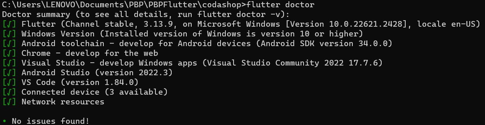
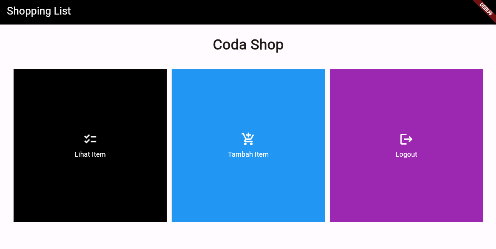

# CodaShop : Everything you need.

# Assignment 7 (Flutter)

# Apa perbedaan utama antara stateless dan stateful widget dalam konteks pengembangan aplikasi Flutter?

Pada `stateless`, widget **TIDAK MENYIMPAN**  data sehingga menyebabkan :

- `Immutable` yang berarti pada perubahan apapun tidak akan menyebabkan perubahan.

- `Tidak dapat diperbaharui secara dinamis` yang berarti diperlukan widget lain setiap diadakan perubahan data.

Pada `statefull`, widget **MENYIMPAN** data sehingga menyebabkan :

- `Mutable` yang berarti akan mengalami perubahan jika data dirubah-rubah.

- `Dapat diperbaharui secara dinamis` yang berarti tampilan widget dapat berubah seiring dengan perubahan data. (tidak perlu widget lain).

# Sebutkan seluruh widget yang kamu gunakan untuk menyelesaikan tugas ini dan jelaskan fungsinya masing-masing.

1. `Scaffold` : Sebagai struktur dasar dari program flutter.

2. `Appbar` : Mirip seperti navbar pada django.

3. `SingleChildScrollView` : Berfungsi sebagai 'penambah layar' jika konten yang ditampilkan melebihi batas windows.

4. `Padding` : Untuk memberikan jarak antar konten.

5. `Column` : Menata konten secara kolom (vertikal).

6. `Text` : Menampilkan text dan memungkikan untuk kita berikan sentuhan 'styling'.

7. `GridView` : Membuat format tampilan menajadi grid.

8. `InkWell` : Memberikan efek pada saat ditekan.

9. `Icon` : Menyediakan berbagai jenis icon untuk kebutuhan tampilan flutter.

10. `SnackBar:` : Menampilkan semacam pesan setelah melakukan sebuah event tertentu.

11. `Container` : Berfungsi untuk mengatur tata letak.

12. `Material` : Menmberi akses stytling pada child class-nya.

<br>

# Implement Checklist😎

1. Siapkan hal-hal yang diperlukan untuk dapat menggunakan flutter :



2. Jalankan perintah untuk membuat project flutter dan menjalankannya :

```py
flutter create <APP_NAME>
cd <APP_NAME>
flutter run
```

3. Membuat file baru dengan nama `menu.dart` pada directory `codashop/lib` dan import file yang dibutuhkan :

```py
import 'package:flutter/material.dart';
```

4. Pada file `main.dart`, kita pindahkan 2 class ke `menu.dart` yang sudah dibuat sebelumnya :
- `MyHomePage`
- `MyHomePageState`

dan lakukan import untuk mengatasi error yang akan terjadi.
```py
import 'package:shopping_list/menu.dart';
```

5. Pada `main.dart`, ubahlah code `MyHomePage(title: 'Flutter Demo Home Page')` menjadi `MyHomePage()`

6. Ganti class `HomePage` menjadi `StatelessWidget` dengan detail code sebagai berikut dan hapus state dibawahnya (karna kita tidak akan memerlukan state tersebut):

```py
class MyHomePage extends StatelessWidget {
    MyHomePage({Key? key}) : super(key: key);

    @override
    Widget build(BuildContext context) {
        return Scaffold(
            ...
        );
    }
}
```
7. Membuat class item yang akan dijual dengan code berikut :

```py
class ShopItem {
  final String name;
  final IconData icon;
  final Color color; #ini code yang ditambahkan sendiri untuk dapat bonus😁

  ShopItem(this.name, this.icon, this.color);
}
```
Tuliskan code berikut tepat di bawah `MyHomePage({Key? key}) : super(key: key);` :

```py
    final List<ShopItem> items = [
    ShopItem("Lihat Item", Icons.checklist, Colors.black),
    ShopItem("Tambah Item", Icons.add_shopping_cart, Colors.blue),
    ShopItem("Logout", Icons.logout, Colors.purple),
    ];
    #ada tambahan contructor colors pada tiap card (tiap card harus punya warna masing-masing)
```

8. Menambahkan code berikut pada Scaffold (berfungsi sebagai kerangka atau dasar dari program flutter) :

```py
return Scaffold(
            appBar: AppBar(
        title: const Text(
          'Shopping List',
          style: TextStyle(color: Colors.white),
        ),
        backgroundColor: Colors.black,
      ),
      body: SingleChildScrollView(
        // Widget wrapper yang dapat discroll
        child: Padding(
          padding: const EdgeInsets.all(10.0), // Set padding dari halaman
          child: Column(
            // Widget untuk menampilkan children secara vertikal
            children: <Widget>[
              const Padding(
                padding: EdgeInsets.only(top: 10.0, bottom: 10.0),
                // Widget Text untuk menampilkan tulisan dengan alignment center dan style yang sesuai
                child: Text(
                  'Coda Shop', // Text yang menandakan toko
                  textAlign: TextAlign.center,
                  style: TextStyle(
                    fontSize: 30,
                    fontWeight: FontWeight.bold,
                  ),
                ),
              ),
              // Grid layout
              GridView.count(
                // Container pada card kita.
                primary: true,
                padding: const EdgeInsets.all(20),
                crossAxisSpacing: 10,
                mainAxisSpacing: 10,
                crossAxisCount: 3,
                shrinkWrap: true,
                children: items.map((ShopItem item) {
                  // Iterasi untuk setiap item
                  return ShopCard(item);
                }).toList(),
              ),
            ],
          ),
        ),
      ),
    );
```
dan tambahkan code berikut untuk membuat cards pada item yang sudah dibuat sebelumnya :

```py
return Material(
      color: item.color,
      child: InkWell(
        // Area responsive terhadap sentuhan
        onTap: () {
          // Memunculkan SnackBar ketika diklik
          ScaffoldMessenger.of(context)
            ..hideCurrentSnackBar()
            ..showSnackBar(SnackBar(
                content: Text("Kamu telah menekan tombol ${item.name}!"), backgroundColor: item.color));
                
        },
        child: Container(
          // Container untuk menyimpan Icon dan Text
          padding: const EdgeInsets.all(8),
          child: Center(
            child: Column(
              mainAxisAlignment: MainAxisAlignment.center,
              children: [
                Icon(
                  item.icon,
                  color: Colors.white,
                  size: 30.0,
                ),
                const Padding(padding: EdgeInsets.all(3)),
                Text(
                  item.name,
                  textAlign: TextAlign.center,
                  style: const TextStyle(color: Colors.white),
                ),
              ],
            ),
          ),
        ),
      ),
    );
```
# BONUS

